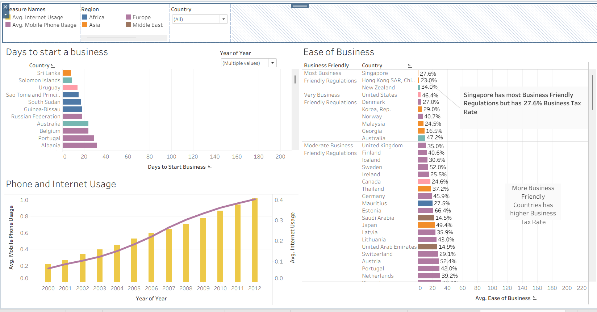
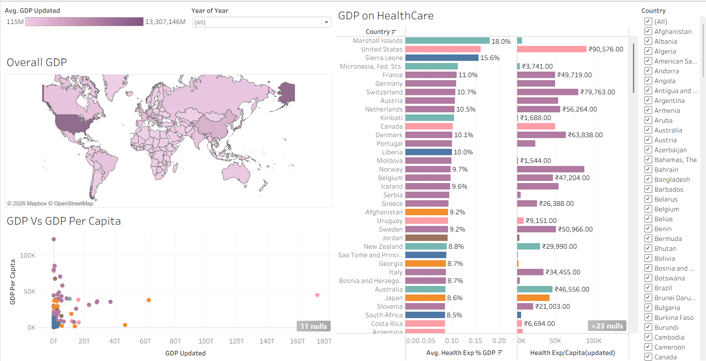
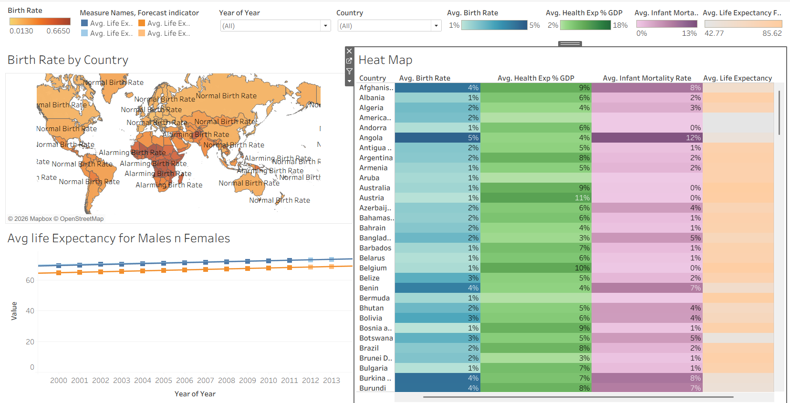
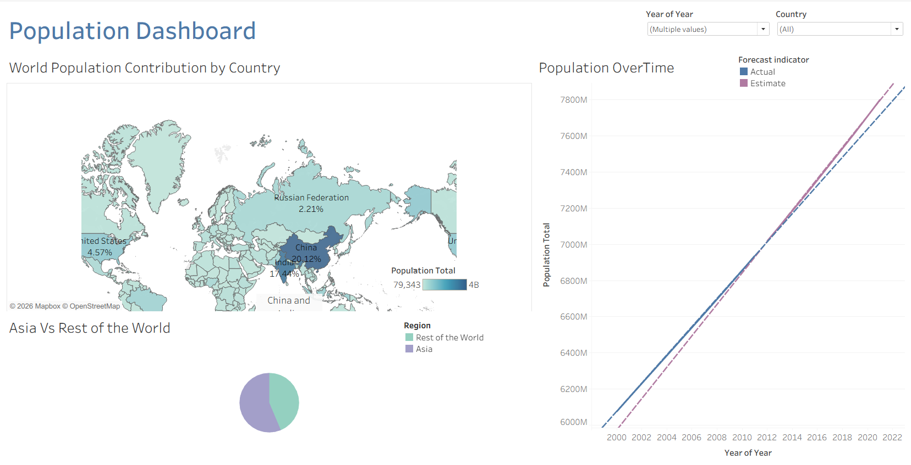

# 🌍 World Development Indicators Analysis

An end-to-end data analytics project analyzing global development indicators across 208 countries from 2000–2012, using a full Python → SQL → Tableau pipeline.

---

## 📊 Dashboard Preview






---

## 🎯 Problem Statement

Understanding global development trends — like how GDP relates to health outcomes, or which regions have the fastest digital adoption — is critical for policy-making. This project cleans, analyses, and visualizes World Bank development data to extract meaningful insights across Population, Health, Economy, and Business dimensions.

---

## 🛠️ Tools & Technologies

| Tool | Purpose |
|------|---------|
| Python (pandas, numpy) | Data Cleaning & Feature Engineering |
| SQL (SQLite) | Data Analysis & Querying |
| Tableau | Interactive Dashboards & Visualization |
| Excel / CSV | Raw Data Source |

---

## 📁 Project Pipeline

```
Raw Data (Excel)
      ↓
Python: Data Cleaning & Feature Engineering
      ↓
SQL: Analysis Queries (10 queries)
      ↓
Tableau: 4 Interactive Dashboards
```

---

## 🐍 Python — Data Cleaning Steps

1. Loaded 2,704-row, 28-column dataset
2. Dropped irrelevant metadata columns
3. Fixed mixed data types — removed `$`, `,`, `%` symbols from monetary columns
4. Dropped `Ease of Business` column (93% null values)
5. Filled missing values using **region-wise median** for demographic indicators
6. Filled remaining nulls with **global median** for economic indicators
7. Engineered new features:
   - `GDP Per Capita` = GDP / Population
   - `Tourism Balance` = Inbound − Outbound Tourism
   - `Life Expectancy Avg` = (Female + Male) / 2
   - `GDP Category` = Income group classification
8. Exported clean data to CSV — **0 null values remaining**

---

## 🗄️ SQL — Analysis Queries

| # | Query | Insight |
|---|-------|---------|
| 1 | Top 10 Countries by GDP Per Capita | Wealthiest nations per person |
| 2 | Regional Health vs Life Expectancy | Does more health spending = longer life? |
| 3 | Internet & Mobile Usage Growth | Digital adoption trends over time |
| 4 | Top 10 Countries by Infant Mortality | Healthcare intervention priorities |
| 5 | Tourism Balance by Region | Net tourism earners vs spenders |
| 6 | GDP Category Distribution | Income group spread by region |
| 7 | CO2 Emissions vs GDP | Do richer countries pollute more? |
| 8 | Population Demographics by Region | Young vs aging populations |
| 9 | Ease of Business by Region | Most business-friendly regions |
| 10 | Global Population & Birth Rate Trend | Is world population growth slowing? |

---

## 📊 Tableau Dashboards

Four interactive dashboards with year and country filters:

1. **Population Dashboard** — World map, Asia vs Rest of World, population growth forecast
2. **Health Dashboard** — Birth rate map, life expectancy trends, health indicators heat map
3. **Economy Dashboard** — GDP map, GDP vs GDP Per Capita scatter, healthcare spending
4. **Business Dashboard** — Days to start a business, ease of business, phone & internet usage

---

## 🔍 Key Insights

- **Europe** has the highest average life expectancy (76.67 years) and spends ~8% of GDP on health
- **Africa** has the lowest life expectancy (55.93 years) despite spending 5.8% of GDP on health
- **Global internet usage** grew from near 0% in 2000 to over 30% by 2012
- **China and India** together account for ~37% of world population
- **Singapore** has the most business-friendly regulations but still maintains a 27.6% business tax rate

---

## 📂 Files in This Repository

```
World-Indicators-Analysis/
│
├── world_indicators_cleaning.py      # Python data cleaning script
├── world_indicators_analysis.sql     # SQL analysis queries (10 queries)
├── world_indicators_cleaned.csv      # Cleaned dataset output
├── World_Indicators.xlsx             # Original raw dataset
├── screenshots/                      # Tableau dashboard screenshots
│   ├── population_dashboard.png
│   ├── health_dashboard.png
│   ├── economy_dashboard.png
│   └── business_dashboard.png
└── README.md                         # Project documentation
```

---

## 💡 What I Learned

- Real-world data cleaning using Python pandas — handling nulls strategically
- Region-wise median imputation vs global median — choosing the smarter approach
- Writing meaningful SQL queries that answer business questions
- Building multi-dashboard Tableau stories with calculated fields and filters
- End-to-end project thinking: from raw messy data to polished insights

---

## 👩‍💻 Author

**Palak Raj**
- LinkedIn: [linkedin.com/in/palak-raj-91b7b4290](https://linkedin.com/in/palak-raj-91b7b4290)
- GitHub: [github.com/PalakRaj0209](https://github.com/PalakRaj0209)
